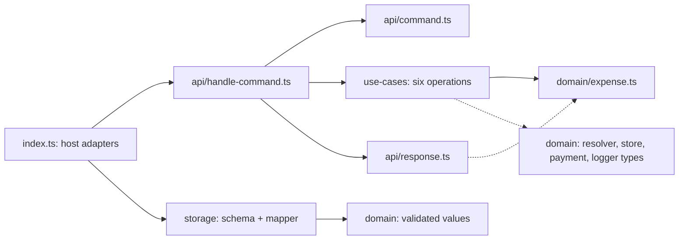
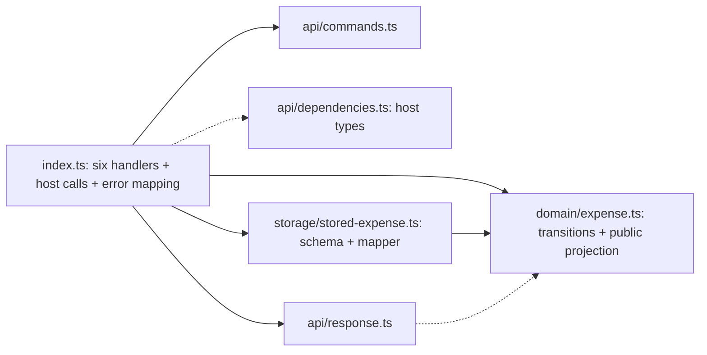

# Architecture review of the generated implementations

The ladder's smaller source footprint includes both less repetition and fewer
separate application boundaries. The current benchmark establishes behavior on
one small module; it does **not** establish that the smaller architecture is
easier to maintain or suitable for a larger system.

All twelve projects are now [expanded for source review](implementations/README.md),
with their original directory layout, source, tests, design, and dependency locks.
No generated implementation was refactored to improve its presentation.

## Scope and reading order

The detailed comparison below uses GPT-5.5 repetition 2:
[kamae](implementations/5.5/02-kamae/README.md) and
[kamae + ladder](implementations/5.5/02-kamae-ladder/README.md).
Both passed the original 19 acceptance checks and five exploratory boundary
probes. This pair illustrates the structural tradeoff; the other outputs and
their failures remain in the [complete results](report.md).

Read the frozen [PRD](implementations/_inputs/PRD.md) and
[API contract](implementations/_inputs/API.md) first. They require a TypeScript
module with six commands and injected repository, payment, and logger functions.
They explicitly exclude an HTTP server, UI, authentication, deployment,
concurrency, and crash recovery. The generated tests use in-memory host fakes.
Database integration and whole-system architecture were not measured.

## Actual module structure

Counts below exclude tests; lines are physical lines including imports and
whitespace. The project indexes show every filename and its line count.

| Responsibility / location | kamae | kamae + ladder |
| --- | --- | --- |
| Total production | 27 files / 963 lines | 14 files / 623 lines |
| Public entry and host integration | `index.ts`: 88 lines | `index.ts`: 200 lines |
| Command validation and API mapping | `api/`: 245 lines | `api/`: 107 lines |
| Use-case orchestration | Six `use-cases/` files: 226 lines | Six private handlers in `index.ts` |
| Domain model, values, dependency contracts | `domain/`: 234 lines | `domain/`: 203 lines; host dependency types in `api/` |
| Storage validation and mapping | Two `storage/` files: 150 lines | One `storage/` file: 113 lines |
| Shared helpers | `support/`: 20 lines | No corresponding directory |
| Runtime packages | Zod + neverthrow | Zod |
| Generated tests | One file / 291 lines | One file / 327 lines |

The top-level directories are:

```text
kamae                          kamae + ladder
src/                           src/
  index.ts                       index.ts
  api/                           api/
  use-cases/                     domain/
  domain/                        storage/
  storage/                       expense-service.test.ts
  support/
  expense-service.test.ts
```

These diagrams summarize source dependencies, not every import. Dashed edges
show dependency types. Concrete host adapters in the control are injected into
the use cases when the public service is constructed.





## Follow one operation across files

For **payment** in the control, read:

1. [Host composition and gateway validation](implementations/5.5/02-kamae/src/index.ts#L6).
2. [Command dispatch and HTTP-style error mapping](implementations/5.5/02-kamae/src/api/handle-command.ts#L86).
3. [The payment use case](implementations/5.5/02-kamae/src/use-cases/pay-expense.ts).
4. [Pure state transitions](implementations/5.5/02-kamae/src/domain/expense.ts)
   and the [validated payment contract](implementations/5.5/02-kamae/src/domain/payment-gateway.ts).
5. [Storage mapping](implementations/5.5/02-kamae/src/storage/expense-record-mapper.ts)
   and [public response projection](implementations/5.5/02-kamae/src/api/response.ts).

For **payment** with the ladder, read:

1. [Command validation](implementations/5.5/02-kamae-ladder/src/api/commands.ts).
2. [Loading, gateway confirmation, saving, and response mapping](implementations/5.5/02-kamae-ladder/src/index.ts#L121).
3. [State transitions and public projection](implementations/5.5/02-kamae-ladder/src/domain/expense.ts).
4. [Storage schema and mapping](implementations/5.5/02-kamae-ladder/src/storage/stored-expense.ts)
   and the [host dependency contract](implementations/5.5/02-kamae-ladder/src/api/dependencies.ts).

Both retain positive payment confirmation, persisted reviewer identity, an
idempotent already-paid path, command/storage validation, and email redaction in
this pair. The ladder has not removed the domain or storage boundary entirely.

## Structural review

These are source-based maintainability observations, not new acceptance failures
or measured change-cost results. Kamae's domain, boundary, and error-handling
principles guide the review; style preferences do not retroactively change the
benchmark score.

### Application logic is coupled to the response format in the ladder output

In the ladder's [entry module](implementations/5.5/02-kamae-ladder/src/index.ts#L44),
`loadForMutation` returns either an expense or `HandleResponse`. All operation
handlers return that same transport response and remain private to the module.
Gateway I/O, persistence, dispatch, and error mapping share the file. In the
control, [the payment use case](implementations/5.5/02-kamae/src/use-cases/pay-expense.ts#L15)
depends on domain ports and returns a domain `Result`; the API maps it later.

A second caller such as a batch job would therefore reuse a transport-neutral
workflow directly in the control, while the ladder version would need an
extraction or would consume the existing command/response API. That is a concrete
coupling tradeoff, not evidence of a current behavioral bug. If a second caller
becomes a requirement, extract the relevant workflow into `application/pay.ts`
and leave response mapping in the adapter; avoid adding layers merely to match
the control's file count. This follows the separation described in
[error handling](../../../skills/kamae/error-handling.md).

### Public response projection has moved into the domain module

The ladder's [ExpenseView and toView](implementations/5.5/02-kamae-ladder/src/domain/expense.ts#L32)
share a module with state transitions. The control's equivalent lives in
[api/response.ts](implementations/5.5/02-kamae/src/api/response.ts#L25).
Changing only the public response shape now touches the domain source file in
the ladder version. This remains a pure function and does not introduce an I/O
dependency, but it reduces separation between presentation and domain policy.
Moving that existing projection into `api/response.ts` would restore the boundary
without a new abstraction or library. See
[domain modeling](../../../skills/kamae/domain-modeling.md).

### Error mapping loses explicit coverage in both versions

The ladder has a closed `TransitionError` union, but
[transitionErrorResponse](implementations/5.5/02-kamae-ladder/src/index.ts#L32)
accepts `{ kind: string }` and silently maps every new kind to 500. The control's
[dispatch mapping](implementations/5.5/02-kamae/src/api/handle-command.ts#L43)
also uses fallback branches that would map a newly introduced business error to
409. Merely having more files or neverthrow does not fix that gap.

For an extension, retain the concrete error union through the adapter and check
its exhaustiveness, following [error handling](../../../skills/kamae/error-handling.md):

```ts
const transitionErrorResponse = (error: TransitionError): HandleResponse => {
  switch (error.kind) {
    case "unauthorized_submit":
    case "self_review":
      return Response.error(403, error.kind);
    case "invalid_state":
      return Response.error(409, error.kind);
    default: {
      const unhandled: never = error;
      return unhandled;
    }
  }
};
```

This example is a review suggestion, not an edit to the frozen implementation.

### Some reductions remove repetition while preserving boundaries

The ladder shares `loadForMutation` and `saveAndLog`, combines the storage schema
with its mapper, and defines shared storage fields once through `StoredBase`.
The control repeats storage fields for each state and repeats save/log sequences
and response mappings. Both retain focused value-object files and pure state
transitions. Neither generic Result wrappers nor a separate file for each short
port can, by themselves, establish a quality advantage.

The 340-line difference cannot be classified entirely as removable boilerplate:
these are independent generations with different error representations,
projections, dependency contracts, and layout. The entry module itself grows
from 88 to 200 lines while total source shrinks.

### The tests do not measure the value of the separate boundaries

Both generated suites import the public `createExpenseService` and exercise
commands with fake host dependencies. Neither suite directly tests the exported
domain transitions or control use cases in isolation. Their passing scores
therefore do not demonstrate a maintenance or test-isolation advantage for
either layout. Additional work such as a cancellation rule, another payment
adapter, or a batch caller would be needed to measure change cost and regression
risk; none was performed in this experiment.

## Review conclusion

The control exposes application boundaries more clearly but contains repeated
adapter and mapping code. The ladder retains several important boundaries while
concentrating orchestration and response concerns. Both are small module designs.
The observed code reduction is real; an overall architectural quality advantage
remains unproven. Use the [full project indexes](implementations/README.md) to
review those tradeoffs across every run rather than judging only `index.ts`.
